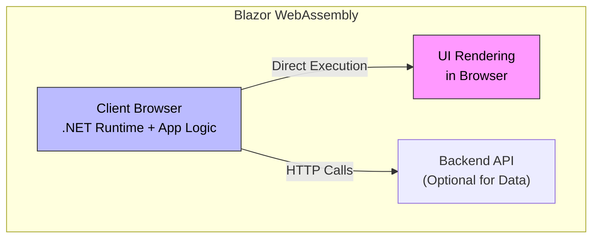
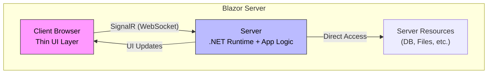

# Blazor: WebAssembly vs Server

## Overview

**Blazor WebAssembly (WASM)** runs your entire .NET application in the browser using WebAssembly. The app is downloaded once and executes locally, offering offline capabilities and reduced server load. It's ideal for client-heavy applications but requires larger initial downloads.

**Blazor Server** keeps your .NET application on the server and streams UI updates to the browser via SignalR/WebSocket. The browser only renders the UI, making it lightweight and fast to load. It's better for real-time collaboration and server-side resource access, but depends on a constant connection.

## Architecture Diagrams

