# System Architecture

This system demonstrates real-time spatial data visualization using two main applications sharing a database.

## System Overview

```mermaid
flowchart LR
    RoverSim["🤖 RoverSimulator<br/>Console App"]
    DB[("💾 Database<br/>PostgreSQL/GeoPackage")]
    Frontend["🌐 FrontendLeaflet<br/>Blazor Server"]
    Browser["🖥️ Browser<br/>Leaflet Map"]
    
    RoverSim -->|"Writes rover data<br/>(every 1s)"| DB
    DB -->|"Reads rover data<br/>(every 8s)"| Frontend
    Frontend -.->|"SignalR WebSocket"| Browser
    
    style RoverSim fill:#ff9999,color:#000000
    style DB fill:#ffcc99,color:#000000,stroke:#333
    style Frontend fill:#99ccff,color:#000000
    style Browser fill:#cc99ff,color:#000000
```

**RoverSimulator** generates simulated rover data (position, wind measurements) and writes to the database every second.

**FrontendLeaflet** is a Blazor Server application that polls the database every 8 seconds, calculates coverage polygons, and displays everything in real-time on an interactive map.

**Database** can be either PostgreSQL/PostGIS (production) or GeoPackage files (local development).

## Data Flow - Blazor Server Polling

This diagram shows how data flows from the database to the browser through the Blazor Server application:

The Blazor Server component polls the database every 8 seconds for new measurements, calculates coverage polygons, and pushes updates to the browser via SignalR WebSocket.

## Map Updates - JavaScript Interop

This diagram shows how the Leaflet map is updated through JavaScript interop:

Blazor Server uses JavaScript interop to control the Leaflet map. Map initialization and all updates are sent through SignalR WebSocket to the browser where Leaflet renders the visualization.

## Key Components

### RoverSimulator (Console Application)
Generates simulated rover data with position and wind measurements. Supports multiple rovers and sessions. Writes measurements to database every second using `IRoverDataRepository`.

**Configuration**: Session name, rover ID, and rover name via command-line arguments or `appsettings.json`.

### Database (PostgreSQL/PostGIS or GeoPackage)
Stores rover measurements with spatial data. Supports session isolation where multiple rovers can share the same session.

- **PostgreSQL**: Production database with `rover_sessions` and `rover_points` tables
- **GeoPackage**: File-based SQLite spatial database for local development

### IRoverDataRepository (Data Access Layer)
Unified interface with two implementations:
- `PostgresRoverDataRepository` - PostgreSQL/PostGIS access via Npgsql
- `GeoPackageRoverDataRepository` - GeoPackage file access

**Key methods**: `InitializeAsync()`, `InsertAsync()`, `GetAllAsync()`, `GetNewSinceSequenceAsync()`

### ScentPolygonGenerator (Business Logic)
Calculates coverage polygons from rover measurements and wind data. Uses `IMemoryCache` with 1-second TTL to optimize performance.

**Key methods**: `GetUnifiedPolygonAsync()`, `GetRoverUnifiedPolygonsAsync()`, `GetForestIntersectionAreasAsync()`

### FrontendLeaflet (Blazor Server)
Web application that visualizes rover data on an interactive Leaflet map. Polls database every 8 seconds and pushes updates to the browser via SignalR WebSocket.

**Main components**:
- `Index.razor` - Main page with polling timer and data management
- `ScentMap.razor` - Leaflet map with JavaScript interop for visualization
- `ForestCoveragePie.razor` - Statistics display

## Real-time Data Flow

1. **RoverSimulator** writes measurements to database (every 1s per rover)
2. **FrontendLeaflet** polls for new data using `GetNewSinceSequenceAsync()` (every 8s)
3. **ScentPolygonGenerator** calculates coverage polygons with memory caching (1s TTL)
4. **SignalR** pushes UI updates to browser via WebSocket
5. **Leaflet** renders the visualization in the browser

## Architecture Notes

- **Blazor Server**: Server-side rendering with direct dependency injection access to repositories (no REST API)
- **Session-aware**: All components filter data per session using `ISessionContext`
- **Multiple rovers**: Each rover has unique ID, name, and visual identity on the map
- **Database agnostic**: Supports both PostgreSQL and GeoPackage through unified repository interface
- **On-demand processing**: Polygon generation happens only on request, not as a background service
