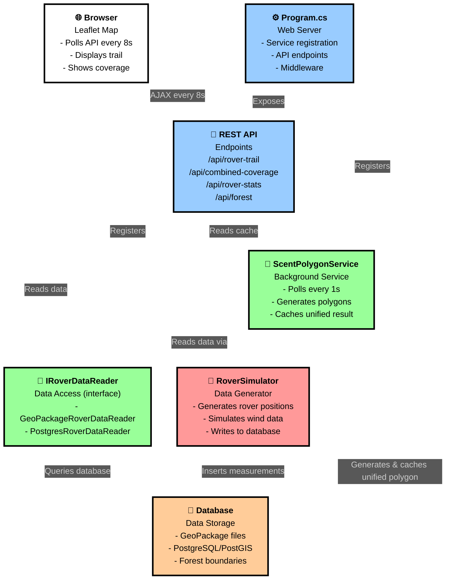

# System Application Flow

Detta diagram visar det kompletta dataflödet i systemet, från simulering till visualisering.

## Komponenter och Dataflöde

### 1. Data Generation (Röd)
**RoverSimulator** - Konsolapplikation som:
- Genererar simulerad rover-position baserat på skog-gränser från GeoPackage
- Simulerar vinddata (hastighet och riktning)
- Skriver mätningar till databas var 1 sekund
- Stödjer både GeoPackage och PostgreSQL/PostGIS

### 2. Data Storage (Orange)
**Database** - Lagring av mätdata:
- **GeoPackage**: OGC-standard, SQLite-baserad, filbaserad spatial data
- **PostgreSQL/PostGIS**: Server-baserad spatial databas
- Innehåller: rover_measurements tabell med position, vind, timestamp

### 3. Data Access (Grön)
**IRoverDataReader** - Abstraktion med två implementationer:
- **GeoPackageRoverDataReader**: Läser från .gpkg filer
- **PostgresRoverDataReader**: Läser från PostgreSQL via Npgsql + NetTopologySuite
- API: `GetAllMeasurementsAsync()`, `GetLatestMeasurementAsync()`, `GetNewMeasurementsAsync()`

### 4. Background Processing (Grön)
**ScentPolygonService** - Hosted service som:
- Pollar IRoverDataReader var 1 sekund
- Genererar doftpolygoner från nya mätningar
- Använder **ScentPolygonLibrary** för geometriberäkningar
- Cachar unified polygon för prestanda
- Exponerar `GetUnifiedScentPolygonCached()` för API

### 5. Web Server (Blå)
**Program.cs** - ASP.NET Core web application:
- Registrerar services via Dependency Injection
- Mappar REST API endpoints
- Serverar Blazor-komponenter

**REST API** - Endpoints:
- `/api/rover-trail` - LineString med rover-spår
- `/api/combined-coverage` - Unified doftpolygon från cache
- `/api/rover-stats` - Statistik (antal mätningar, senaste position)
- `/api/forest` - Skoggräns-polygon från GeoPackage

### 6. Frontend (Vit)
**Browser med Leaflet.js**:
- Pollar API var 8 sekund
- Visar karta med OpenStreetMap tiles
- Ritar rover trail (blå linje)
- Ritar coverage polygon (röd)
- Visar aktuell position (markör)

## Dataflöde i Realtid

1. **RoverSimulator** skriver mätning → **Database** (var 1s)
2. **ScentPolygonService** upptäcker ny data → genererar polygon → uppdaterar cache (var 1s)
3. **Browser** hämtar `/api/rover-trail` och `/api/combined-coverage` → uppdaterar karta (var 8s)

### Timing
- **Backend poll**: 1 sekund (ScentPolygonService → IRoverDataReader)
- **Frontend poll**: 8 sekunder (Browser → REST API)
- **Simulator**: 1 sekund per mätning
