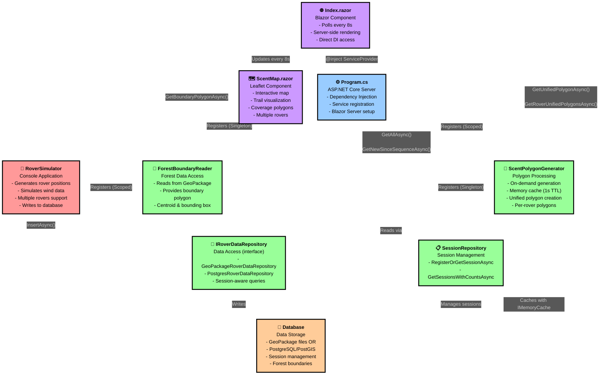

# System Application Flow

Detta diagram visar det kompletta dataflödet i systemet, från simulering till visualisering.

## Komponenter och Dataflöde

### 1. Data Generation (Röd)
**RoverSimulator** - Konsolapplikation som:
- Genererar simulerad rover-position baserat på skog-gränser från GeoPackage
- Simulerar vinddata (hastighet och riktning)
- Stödjer flera samtidiga rovers med unika ID:n och namn
- Skriver mätningar till databas var 1 sekund via `IRoverDataRepository.InsertAsync()`
- Stödjer både GeoPackage och PostgreSQL/PostGIS
- Session-aware: Varje rover tillhör en namngiven session
- Kommandoradsargument: `--session`, `--rover`, `--rover-name`

### 2. Data Storage (Orange)
**Database** - Lagring av mätdata:
- **GeoPackage**: OGC-standard, SQLite-baserad, filbaserad spatial data
  - Fil per session: `{sessionName}.gpkg`
  - Lager: `rover_points` med geometri
- **PostgreSQL/PostGIS**: Server-baserad spatial databas med schema `roverdata`
  - Tabell: `rover_sessions` (session_id, session_name, created_at, last_updated)
  - Tabell: `rover_points` (id, rover_id, rover_name, session_id, sequence, recorded_at, lat, lon, wind_direction, wind_speed, geom)
- Stödjer session isolation: Flera rovers kan dela samma session

### 3. Data Access Layer (Grön)
**IRoverDataRepository** - Unified read/write interface med två implementationer:
- **GeoPackageRoverDataRepository**: Läser/skriver från .gpkg filer
- **PostgresRoverDataRepository**: Läser/skriver från PostgreSQL via Npgsql + NetTopologySuite
- API-metoder:
  - `InitializeAsync()` - Skapar schema/tabeller, registrerar session
  - `InsertAsync(measurement)` - Lägger till en mätning
  - `GetAllAsync()` - Hämtar alla mätningar för sessionen
  - `GetNewSinceSequenceAsync(lastSequence)` - Inkrementell hämtning av nya data
- Session-medveten: Använder `ISessionContext` för att filtrera per session
- Property: `SessionId` - Tillhandahålls efter `InitializeAsync()`

**SessionRepository** - Session management (endast PostgreSQL):
- `RegisterOrGetSessionAsync(sessionName)` - Skapar eller hämtar session-ID
- `GetSessionsWithCountsAsync()` - Listar tillgängliga sessioner med antal mätningar

**ISessionContext** - Kontext-abstraction:
- Implementationer: `ConsoleSessionContext`, `WebSessionContext`
- Tillhandahåller `SessionId` och `SessionName` per operation/request

### 4. Business Logic (Grön)
**ScentPolygonLibrary** - Class library för doftpolygon-beräkningar:

**ScentPolygonGenerator** (huvudklass med caching):
- Använder `IRoverDataRepository` för att hämta mätningar
- Genererar individuella doftpolygoner per mätning via `ScentPolygonCalculator`
- Skapar unified polygon med overlap-hantering
- Cachar resultat med `IMemoryCache` (TTL: 1 sekund)
- API-metoder:
  - `GetUnifiedPolygonAsync()` - Sammanslagen polygon för alla rovers
  - `GetRoverUnifiedPolygonsAsync()` - Per-rover unified polygons
  - `GetForestIntersectionAreasAsync()` - Area calculations

**ScentPolygonCalculator** (statisk hjälpklass):
- Rena geometriberäkningar utan state eller caching
- `CreateScentPolygon()` - Genererar fan-shaped upwind cone från position + vind
- `CreateUnifiedPolygon()` - Merger flera polygons med Union operation
- `CalculateScentAreaM2()` - Area-beräkning med latitud-kompensation

**ScentPolygonTypes** (datamodeller):
- `ScentPolygonResult` - Individuell polygon per mätning
- `UnifiedScentPolygon` - Sammanslagen polygon
- `RoverUnifiedPolygon` - Per-rover unified polygon
- `ScentPolygonConfiguration` - Konfiguerbara parametrar (radier, vinklar)

**ForestBoundaryReader** - GeoPackage reader för skoggräns:
- Läser från `RiverHeadForest.gpkg`
- `GetBoundaryPolygonAsync()` - Hämtar skogens boundary polygon
- `GetBoundingBoxAsync()` - Bounding box för rovers
- `GetCentroidAsync()` - Startpunkt för rovers

### 5. Web Server (Blå)
**Program.cs** - ASP.NET Core Blazor Server application:
- Dependency Injection setup:
  - **Scoped**: `IRoverDataRepository`, `ISessionContext`, `ScentPolygonGenerator`
  - **Singleton**: `ForestBoundaryReader`, `ISessionRepository`, `NpgsqlDataSource`, `IMemoryCache`
- Registrerar services baserat på `appsettings.json`:
  - `DatabaseConfiguration.DatabaseType`: "postgres" eller "geopackage"
  - `DatabaseConfiguration.SessionName`: Namn på session att visualisera
- Initialiserar PostgreSQL schema vid startup med `PostgresDatabaseInitializer`
- Konfigurerar Blazor Server middleware
- Mappar Blazor Hub och fallback page

### 6. Frontend (Lila)
**Index.razor** - Blazor Server huvudkomponent:
- Injicerar `IServiceProvider`, `ForestBoundaryReader`
- Pollar databas var 8:e sekund med `Timer`
- `LoadInitialDataAsync()`:
  - Hämtar forest boundary från `ForestBoundaryReader`
  - Läser alla mätningar med `IRoverDataRepository.GetAllAsync()`
  - Grupperar per rover och uppdaterar trail och position
  - Hämtar unified polygon från `ScentPolygonGenerator`
- `LoadIncrementalDataAsync()`:
  - Hämtar nya mätningar med `GetNewSinceSequenceAsync()`
  - Uppdaterar endast nya data per rover
  - Uppdaterar coverage polygon från cache
- Spårar `_lastSequencePerRover` för effektiv incremental polling
- **Server-side rendering**: Inga HTTP calls, direkt DI-access till repositories

**ScentMap.razor** - Leaflet map component:
- Interaktiv karta med OpenStreetMap tiles
- JavaScript interop för Leaflet-biblioteket
- Visar multiple rovers med olika färger per rover
- Metoder:
  - `UpdateForestBoundaryAsync()` - Visar skoggräns
  - `UpdateRoverTrailAsync()` - Ritar spår för en rover
  - `AppendRoverTrailCoordsAsync()` - Lägger till nya punkter till trail
  - `UpdateRoverPositionAsync()` - Uppdaterar marker med rover-namn, vind
  - `UpdateCoverageAsync()` - Visar unified coverage polygon

**RoverSelector.razor** - Session selection component (optional):
- Låter användare välja session att visualisera
- Anropar `SessionRepository` för att lista tillgängliga sessioner

**ForestCoveragePie.razor** - Statistics component:
- Visar täckningsgrad av skog
- Hämtar data från `ScentPolygonGenerator.GetForestIntersectionAreasAsync()`

## Dataflöde i Realtid

1. **RoverSimulator** skriver mätning → **IRoverDataRepository** → **Database** (var 1s per rover)
2. **Index.razor** pollar → **IRoverDataRepository.GetNewSinceSequenceAsync()** → **Database** (var 8s)
3. **Index.razor** hämtar polygon → **ScentPolygonGenerator.GetUnifiedPolygonAsync()** → **IMemoryCache** (var 8s, cache 1s TTL)
4. **ScentPolygonGenerator** cache miss → läser data → **IRoverDataRepository.GetAllAsync()** → **Database**
5. **ScentMap** uppdaterar Leaflet map via JavaScript interop

### Timing
- **Simulator write**: 1 sekund per mätning per rover
- **Frontend poll**: 8 sekunder (Index.razor timer)
- **Cache TTL**: 1 sekund (ScentPolygonGenerator)
- **No background service**: On-demand processing only

### Architecture Notes
- **Server-side Blazor**: Ingen REST API, direkt DI-access till services
- **Session-aware**: Alla komponenter filtrerar per session via `ISessionContext`
- **Multiple rovers**: Varje rover har unikt ID, namn, och visuell identitet
- **Database agnostic**: GeoPackage för lokal dev, PostgreSQL för production
- **On-demand processing**: Polygon generation sker endast vid request, inte i background
